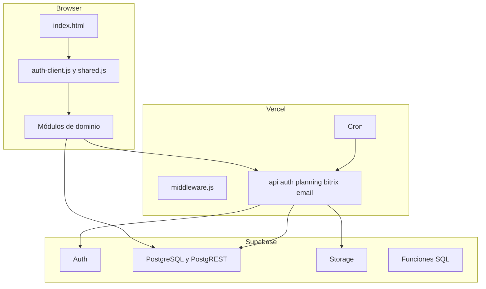

# SYNCRO SHIFT — Arquitectura técnica actual

**Estado:** ACTIVO
**Corte de evidencia:** 2026-10-02

## 1. Estilo arquitectónico

SYNCRO SHIFT es una SPA estática de JavaScript y HTML sin framework ni proceso
de compilación. Los módulos se cargan como scripts globales y comparten estado a
través de `window`. El orden de `<script>` es parte del contrato de ejecución:
la última definición de una función global sustituye a las anteriores.

La aplicación se divide en cuatro capas:

1. interfaz estática y módulos de dominio;
2. cliente de sesión y transporte Supabase;
3. Vercel Functions y middleware;
4. Supabase PostgreSQL, Auth, Storage y RPC.

## 2. Topología

## 3. Cliente web

`index.html` contiene la estructura de la aplicación, el portal, modales y el
orden de carga. `shared.js` concentra transporte, caché, permisos, navegación y
operaciones compartidas. Los archivos de dominio aportan pantallas y reglas de
negocio.

Características relevantes:

- no hay imports ni exports en el cliente;
- el namespace global permite sobrescrituras silenciosas;
- existe caché en memoria y la invalidación depende de cada escritura;
- persisten llamadas directas a Supabase junto al transporte autenticado;
- `adjuntos.js` envuelve y sustituye funciones definidas previamente;
- `main` declara dos cargas consecutivas de `adjuntos.js`.

## 4. Autenticación

El flujo implementado usa selección de empleado y PIN individual de seis
dígitos. El navegador llama a `/api/auth/*`; el backend usa credenciales de
servidor y entrega access tokens mientras conserva el refresh token en una
cookie `HttpOnly`, `Secure` y `SameSite=Strict`.

Los endpoints observados cubren:

- directorio mínimo;
- login, perfil, refresh y logout;
- cambio y reset de PIN;
- aprovisionamiento;
- lectura y administración autorizada de empleados.

`SYNCRO_AUTH_ENABLED` controla el modo seguro. No se debe asumir su valor LIVE
sin leer la configuración de Vercel o verificar el flujo real.

## 5. Autorización

La autorización combina:

- contexto de usuario del backend;
- reglas de rol, puesto y departamento;
- filtros del cliente;
- policies y grants de Supabase.

La migración P0 añade un techo de sesión válida y acceso autenticado temporal a
tablas operativas. No constituye una matriz de mínimo privilegio completa. La
matriz definitiva por rol, tabla, operación, fila y columna sigue sin estar
versionada de forma ejecutable.

## 6. Datos

El esquema funcional incluye dominios de empleados, turnos, tareas, gestiones,
incidencias, caja, Housekeeping, FIO, incentivos, POSMEWS, fichaje y auditoría.

Limitaciones de reproducibilidad:

- las migraciones de `main` cubren la contención Auth/RLS, no el esquema base;
- los documentos históricos enumeran tablas que no tienen DDL versionado;
- los conteos históricos de filas no prueban el estado LIVE actual;
- el proyecto local usa PostgreSQL 17, pero la versión remota no se comprobó.

## 7. Backend y Functions

| Grupo | Responsabilidad |
|---|---|
| `api/auth/*` | Sesión, PIN, perfil, directorio y administración de identidad |
| `api/bitrix-sync.js` | Sincronización periódica Bitrix24 |
| `api/bitrix-backfill-hours.js` | Recuperación histórica de horas |
| `api/monthly-hours.js` | Horas mensuales autenticadas |
| `api/send-email.js` | Envío de correo legacy o controlado por configuración |
| `middleware.js` | Restricción por IP y compatibilidad con el corte Auth |

Producción expone además endpoints de planificación y liquidación Housekeeping
que no están en `main`. Su código aparece en ramas `codex/...`, pero la revisión
exacta desplegada es `[NO DATA]`.

## 8. Integraciones externas

### Bitrix24

Es fuente operativa para fichaje y horarios. En `main` existe divergencia entre
la copia raíz v4 y la Function v3 realmente apuntada por Vercel. No ejecutar el
cron para comprobarlo: puede escribir datos.

### POSMEWS

Los ficheros se procesan en navegador con SheetJS. La documentación histórica
describe cinco tablas normalizadas, pero su DDL no está en las migraciones de
`main`. La fase completa de parsers permanece no demostrada.

### MEWS, Nubimed y VirtuGym

MEWS se usa en reglas de caja y existe una integración Housekeeping propuesta.
Nubimed y VirtuGym aparecen como fuentes de caja SYNCROLAB. Las conexiones API
reales no se verificaron.

## 9. Despliegue

Vercel sirve la SPA, ejecuta Functions y programa el cron. GitHub declara
`main` como rama estable, pero Producción observada contiene recursos ausentes
de `main`. Hasta resolver la trazabilidad, no debe promoverse una nueva versión
basándose únicamente en el árbol de `main`.

## 10. Riesgos arquitectónicos

1. Namespace global y sobrescrituras por orden de carga.
2. Archivos grandes con múltiples responsabilidades.
3. Acceso a datos mediante contratos heterogéneos.
4. Esquema SQL incompleto en migraciones.
5. Diferencia entre `main` y Producción.
6. Integraciones documentadas sin prueba LIVE actual.
7. Documentación histórica con estados y conteos ya caducables.

## 11. Regla para cambios futuros

Antes de modificar un módulo se debe identificar:

- todas sus definiciones y sobrescrituras;
- scripts anteriores y posteriores en `index.html`;
- tablas, Functions, Storage e integraciones implicadas;
- permisos de cliente, backend y RLS;
- pruebas positivas, negativas y regresiones;
- commit, deployment y reversión.

No se introducen nuevos frameworks ni capas si el objetivo puede cerrarse con la
arquitectura existente.
