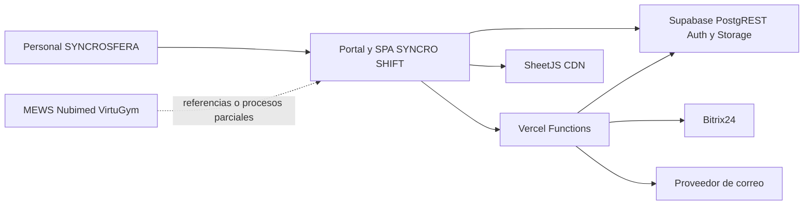

# SYNCRO SHIFT — Documentación maestra

**Estado:** ACTIVO
**Corte de evidencia:** 2026-10-02
**Repositorio:** `AlexSfera/syncro_hub`
**Rama estable observada:** `main` en `38074d99302009228dee8fd8c31fa69c475fc1ab`
**Producción pública observada:** `https://syncro-shift.vercel.app/`
**Página maestra en ChatGPT:** `https://chatgpt.com/space/page_6ac00852788c8191ab3e4cb777d09c40`

## 1. Propósito

Este documento es la entrada principal al proyecto SYNCRO SHIFT. Consolida la
identidad del sistema, su arquitectura, el estado verificable de los módulos,
las integraciones, los riesgos y las fuentes que deben consultar los futuros
agentes.

No sustituye al código ni al estado real de los servicios. Cuando una afirmación
no puede comprobarse con evidencia actual se marca `[NO DATA]`.

## 2. Conclusión ejecutiva

SYNCRO SHIFT es una aplicación operativa interna de SYNCROSFERA construida como
SPA de JavaScript sin framework. El frontend se publica en Vercel, utiliza
Supabase para datos, Auth y Storage, y dispone de Functions para autenticación,
Bitrix24, correo y procesos administrativos.

La portada pública de Producción respondió correctamente el 2026-10-02 y no
registró errores de consola durante esa carga. Esto verifica únicamente la
portada y la carga inicial, no los flujos autenticados ni las operaciones sobre
datos.

Existe una divergencia crítica de trazabilidad: la Producción observada carga
`planificacion_horaria.js` y `housekeeping_incentivos.js`, además de endpoints
asociados, pero esos recursos no existen en `main` a fecha del corte. También
carga una sola copia de `adjuntos.js`, mientras `main` la declara dos veces. La
revisión exacta desplegada y el deployment inmutable de origen son `[NO DATA]`
porque el panel de Vercel requería autenticación y la CLI no estaba disponible.

## 3. Fuentes de verdad

Cuando existan contradicciones se usa este orden:

1. Comportamiento reproducible y configuración real del entorno afectado.
2. Código aprobado en `main` de GitHub.
3. Migraciones SQL versionadas y esquema LIVE comprobado en modo de solo lectura.
4. Este documento, `CURRENT_STATE.md`, `MODULE_STATUS.md` y `ARCHITECTURE.md`.
5. Documentación funcional vigente en `docs/context/`.
6. Registro histórico, archivos `_ARCHIVE` y conversaciones.

Un deployment no demuestra que `main` contenga su código. Un archivo no demuestra
que el flujo funcione. Una prueba local no demuestra comportamiento LIVE.

## 4. Mapa del sistema

La arquitectura detallada está en
[`docs/01-architecture/ARCHITECTURE.md`](01-architecture/ARCHITECTURE.md).

## 5. Estado de GitHub

| Elemento | Estado | Evidencia |
|---|---|---|
| Repositorio | VERIFICADO | Repositorio público `AlexSfera/syncro_hub` |
| Rama estable declarada | VERIFICADO | `main` |
| Commit de `main` observado | VERIFICADO | `38074d99302009228dee8fd8c31fa69c475fc1ab` |
| Fecha del último commit de `main` | VERIFICADO | 2026-08-24 |
| Tests Node | TESTEADO | 28 correctos y 1 E2E Supabase omitido |
| Sintaxis JavaScript | TESTEADO | Todos los `.js` del repositorio pasaron `node --check` |
| Build | NO APLICA | Aplicación estática sin proceso de build declarado |
| Lint | `[NO DATA]` | No existe configuración identificada |
| CI | `[NO DATA]` | No se verificó un pipeline actual |

La rama `main` no representa la Producción observada del 2026-10-02. Antes de
cualquier cambio se debe resolver o documentar expresamente la revisión que está
publicada.

## 6. Estado de Vercel

| Elemento | Estado |
|---|---|
| Dominio público | VERIFICADO: `https://syncro-shift.vercel.app/` |
| Portada | VERIFICADA el 2026-10-02 |
| Errores de consola en portada | Ninguno observado |
| Proyecto local vinculado | `syncro_hub` según `.vercel/project.json` |
| Proyecto o deployment READY actual | `[NO DATA]` |
| Commit exacto desplegado | `[NO DATA]` |
| Variables de entorno y scopes | `[NO DATA]` |
| Reversión inmutable | `[NO DATA]` |

`vercel.json` en `main` programa `/api/bitrix-sync` con cron `0 23 * * *` y
configura 300 segundos para `bitrix-sync` y `bitrix-backfill-hours`.

## 7. Estado de Supabase y SQL

El checkout está vinculado al proyecto `tsfhrpdpbkciofvejrao`, identificado
localmente como `bds-platform`. El esquema LIVE no pudo leerse en esta auditoría;
por tanto, los conteos de tablas, filas, grants y policies de los documentos de
julio y agosto son evidencia histórica, no estado actual.

`main` contiene migraciones versionadas para:

- fundación de Supabase Auth y auditoría;
- contención temporal de `employee_ips`;
- techo autenticado sobre tablas operativas;
- plantilla no ejecutable para el corte RLS definitivo;
- rollbacks de las migraciones ejecutables anteriores.

No existe en `main` una migración base completa que reconstruya todo el esquema
operativo. Tampoco están versionadas en `main` todas las tablas descritas por la
documentación POSMEWS. La reconstrucción íntegra de la base desde Git es, por
tanto, `NO VERIFICADA`.

El [cambio anunciado por Supabase](https://supabase.com/changelog/45329-breaking-change-tables-not-exposed-to-data-and-graphql-api-automatically)
para dejar de autoexponer tablas nuevas refuerza la necesidad de grants
explícitos, RLS y pruebas por rol. La configuración local ya deja
`auto_expose_new_tables` sin activar.

## 8. Integraciones

| Integración | Implementación observada | Estado verificable |
|---|---|---|
| Bitrix24 | Functions de sincronización y backfill | IMPLEMENTADO; ejecución LIVE `[NO DATA]` |
| Supabase | Datos, Auth, Storage y RPC | IMPLEMENTADO; estado LIVE actual `[NO DATA]` |
| Vercel | Hosting, Functions, middleware y cron | PRODUCCIÓN visible; revisión exacta `[NO DATA]` |
| Correo | `api/send-email.js` y servidor de email Auth | IMPLEMENTADO; entrega real `[NO DATA]` |
| POSMEWS | Upload y análisis en navegador | PARCIAL; parsers completos no demostrados |
| MEWS | Datos manuales y diseño HK futuro | Integración automática NO VERIFICADA |
| Nubimed | Referencia operativa de caja SYNCROLAB | Conexión API `[NO DATA]` |
| VirtuGym | Referencia operativa de caja SYNCROLAB | Conexión API `[NO DATA]` |
| n8n | Documentado para automatizaciones futuras | Estado actual `[NO DATA]` |
| SheetJS | CDN cargado por la SPA | IMPLEMENTADO |

## 9. Estado funcional de módulos

La matriz completa está en
[`docs/04-development/MODULE_STATUS.md`](04-development/MODULE_STATUS.md).

Resumen:

- La mayoría de módulos de la SPA están implementados y se cargan en Producción.
- Solo la capa de autenticación tiene pruebas automáticas ejecutadas en este
  corte.
- Ningún flujo autenticado de negocio se marca `VERIFICADO` sin sesión de prueba
  y comprobación del efecto real en Supabase.
- `faults.js` es código huérfano y no se carga.
- Planificación horaria e incentivos Housekeeping existen en Producción pero no
  en `main`; su fuente exacta debe resolverse antes de evolucionarlos.

## 10. Seguridad y autorización

La arquitectura actual usa selección de empleado más PIN individual y endpoints
server-side. Las pruebas locales cubren cookies, validación de PIN, autorización
por ámbito, aprovisionamiento y rutas administrativas.

Los comentarios de migración y los registros históricos afirman que la
contención P0 se aplicó a LIVE el 2026-08-10. Esa afirmación no se revalidó el
2026-10-02 y debe tratarse como `EVIDENCIA HISTÓRICA`.

Riesgos vigentes de documentación o arquitectura:

1. Producción no trazada a `main`.
2. El modelo SQL completo no es reconstruible desde las migraciones de `main`.
3. Coexisten varias vías de acceso a Supabase y contratos de error distintos.
4. La autorización funcional depende de código global y de una matriz RLS que
   no está cerrada tabla por tabla.
5. `adjuntos.js` se carga dos veces en `main`.
6. `bitrix-sync.js` raíz declara v4, pero `api/bitrix-sync.js` en `main` responde
   como v3; el cron apunta al archivo de `api/`.
7. Los helpers de fotos referenciados por varias pantallas no están definidos en
   `main`.
8. Validación Hypoxic referencia acciones de edición y borrado no definidas en
   `main`.

## 11. Calidad y límites de verificación

Ejecutado el 2026-10-02:

- `node --test tests/*.test.js`: 28 pruebas correctas y 1 omitida;
- sintaxis de todos los JavaScript de raíz, `api/`, `lib/` y `scripts/`: correcta;
- carga de la portada pública de Producción: correcta;
- revisión de consola de la portada: sin errores ni avisos;
- comparación de scripts declarados por Producción contra `main`.

No ejecutado:

- tests SQL, por ausencia de CLI/stack local disponible;
- E2E autenticado;
- operaciones de escritura;
- consulta administrativa de Vercel;
- consulta administrativa de Supabase;
- ejecución de cron o sincronización Bitrix;
- pruebas con datos personales o reales.

## 12. Documentación vigente

Lectura obligatoria para futuros agentes:

1. `AGENTS.md`.
2. Este documento.
3. `docs/00-governance/SOURCE_OF_TRUTH.md`.
4. `docs/00-governance/AGENT_INSTRUCTIONS.md`.
5. `docs/01-architecture/ARCHITECTURE.md`.
6. `docs/04-development/CURRENT_STATE.md`.
7. `docs/04-development/MODULE_STATUS.md`.
8. Documento funcional específico del módulo afectado.

Los documentos de `_ARCHIVE`, los handoffs y el registro de auditoría aportan
contexto histórico. No deben usarse como estado actual sin revalidación.

## 13. `[NO DATA]` pendientes

- Deployment inmutable y commit exacto que sirve Producción.
- Estado READY, logs y plan de reversión de Vercel.
- Esquema, policies, grants, funciones, triggers y Storage actuales de Supabase.
- Resultado actual de cron Bitrix y backfills.
- Entrega real del proveedor de correo.
- Pruebas funcionales autenticadas por rol y departamento.
- Fuente Git exacta de los módulos presentes solo en Producción.

## 14. Regla de mantenimiento

Toda actualización documental debe indicar fecha, fuente y nivel de evidencia.
Si cambia código, SQL, configuración, deployment o comportamiento LIVE, se
actualizan este documento, `CURRENT_STATE.md` y `MODULE_STATUS.md` en el mismo
cambio o se registra expresamente por qué no aplica.
